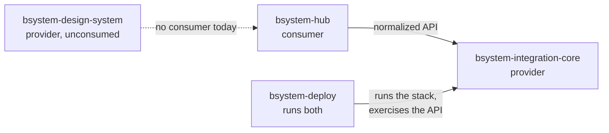

# Cross-repository compatibility

Four repositories, versioned independently. This says which of them is a
provider to which, what holds each pairing, and where a pairing is held by
nothing.

## The pairings

| Consumer | Provider | What they agree on | What holds it |
| --- | --- | --- | --- |
| bsystem-hub | bsystem-integration-core | the normalized API surface | `Normalized API contract` job in HUB's CI: every path the HUB requests must exist in Core's OpenAPI specification |
| bsystem-deploy | bsystem-integration-core | runtime behaviour, Global ID prefixes, RBAC group names, documented endpoints | `Autonomous E2E` job: the real stack, both together, with the scenario suite against it — plus the prefix, group-name and endpoint checks in the same job |
| bsystem-hub | bsystem-design-system | nothing today | **nothing, because there is nothing to hold.** The HUB declares no dependency on the Design System and imports neither its tokens nor its components |

## Integration Core and Deploy are already validated together

This is the pairing with the most at stake and it needs no new machinery: the
`Autonomous E2E` job checks out Integration Core beside this repository, builds
the stack from that source, starts it, and runs the whole scenario suite
against it. A provider change that breaks the platform fails there, in the real
runtime, rather than against a description of it.

The same job now also compares the Global ID prefixes and the BSYSTEM group
names against Core's migrations, and the endpoints named in this repository's
documentation against Core's OpenAPI specification.

## Which pair was validated

A green run is a statement about a *pair* of commits, and until recently it did
not say which pair. Two things now record it:

- the run summary names the Integration Core ref and why it was chosen — a
  matching branch, an explicit request, or a fallback to `main`;
- `compatibility.json` is published as an artifact, carrying both commits, the
  ref, and the resolution.

The distinction matters because a run that fell back to `main` has validated
something real, but not the pairing a reader might assume from a matching
branch name.

## Fallback, and when it is not allowed

Most changes in this repository and in the HUB have no paired Integration Core
branch, so a missing match falls back to `main` and says so. Failing instead
would make the gate an obstacle rather than a check.

A ref asked for by hand is different. `workflow_dispatch` takes a `core_ref`
input, and a value that cannot be resolved fails the run rather than quietly
validating against `main` and reporting it as the requested pair.

The HUB's contract gate draws the line in one more place: when Integration Core
is not checked out at all, it fails. Every other cross-repository check here
degrades to a pass, which is right for them — they compare two things their own
repository owns and the sibling is a bonus. That one has nothing to compare, so
passing would make the gate disappear exactly when CI is misconfigured.

## The Design System has no consumer

`bsystem-design-system` publishes `dist` and two stylesheets, and declares
`react` and `react-dom` as peer dependencies. The HUB depends on neither the
package nor its files: no entry in `package.json`, no import of `tokens.css` or
`components.css`.

So the rule against consuming an unversioned `main` is satisfied in the only
way it currently can be — nothing consumes it at all, by any route. There is no
consumer build to validate, and inventing one to produce a green check would
report a compatibility that nothing depends on.

When the HUB does adopt it, this is the pairing to hold, and the rule to hold it
to is a versioned package rather than a branch.
