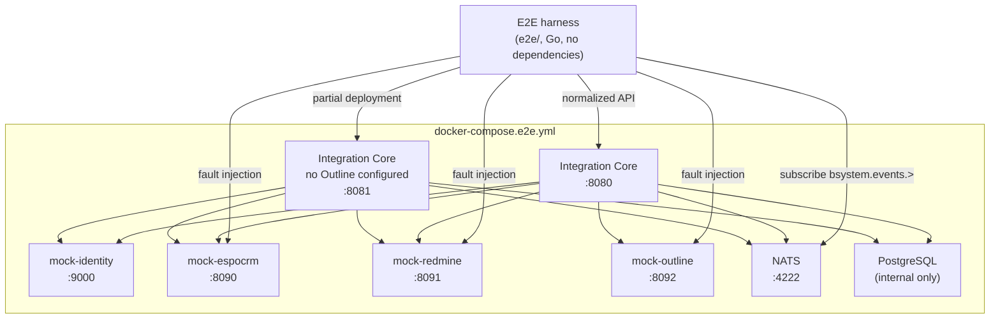

# Autonomous E2E environment

The E2E stack validates BSYSTEM end to end without owner credentials,
production access or any real upstream system. It is the foundation the rest
of the backlog depends on: authorization, adapter and contract work can all be
proven here before any production acceptance step is possible.

## What it runs



A second Integration Core runs from the same image against the same database
with `OUTLINE_URL` deliberately absent. A deployment that leaves an integration
out is a supported configuration, and it is the one a stage acceptance is most
likely to meet — a customer who runs no wiki, or an environment brought up
before the Outline credentials exist. Running one every time is what turns
"the platform starts without Outline" from an assumption into something the
stack demonstrates. Do not "fix" that service by giving it Outline settings.

authentik, EspoCRM, Redmine and Outline are each replaced by a deterministic
mock. The HUB is not part of the stack: the scenarios assert the normalized API
contract the HUB consumes, which is what the HUB's own CI needs to build
against.

## Network isolation

| Network | Internal | Members |
| --- | --- | --- |
| `e2e-edge` | no | Integration Core, the four mocks, NATS |
| `e2e-data` | yes | PostgreSQL, Integration Core |

PostgreSQL is only reachable from inside the stack. Every published port binds
to `127.0.0.1`, so nothing is exposed beyond the machine running the stack.

## Running it

```bash
# From the repository root, with bsystem-integration-core checked out alongside
docker compose -f docker-compose.e2e.yml up -d --build --wait

cd e2e
E2E_BASE_URL=http://127.0.0.1:8080 go test -v ./...

cd ..
docker compose -f docker-compose.e2e.yml down -v
```

`INTEGRATION_CORE_CONTEXT` overrides where the Integration Core is built from;
it defaults to `../bsystem-integration-core`.

The stack shortens two adapter bounds so the scenarios can observe behaviour
that production-length windows would make them sleep through:
`ADAPTER_TIMEOUT` to 2s, so a hanging upstream is retried to exhaustion
quickly, and `ADAPTER_CIRCUIT_OPEN_FOR` to 3s, so an upstream can be seen
being shed and then recovering.

Note that a scenario asserting an upstream *failure* must inject a fault that
outlasts the retry budget. A single injected fault is retried away — which is
the adapter behaving correctly, but says nothing about how a real outage
normalizes.

The scenarios skip themselves when `E2E_BASE_URL` is unset, so `go test ./...`
is safe on a machine with no stack running.

That convenience has a sharp edge: a skipped Go test exits zero. Where the
stack is up and running it is the whole point — CI — a missing `E2E_BASE_URL`
would skip every scenario and report success, and the check would go green
having verified nothing. So CI sets `E2E_REQUIRED=1`, which turns a missing
stack from a skip into a refusal to start. Set it anywhere else the suite is
expected to actually run.

## Harness configuration

| Variable | Default | Purpose |
| --- | --- | --- |
| `E2E_REQUIRED` | unset — scenarios may skip | Set to any value where a skip must be a failure instead |
| `E2E_BASE_URL` | none — unset skips every scenario, unless `E2E_REQUIRED` is set | Integration Core |
| `E2E_PARTIAL_BASE_URL` | `http://127.0.0.1:8081` | the Integration Core with Outline unconfigured |
| `E2E_IDENTITY_URL` | `http://127.0.0.1:9000` | identity mock |
| `E2E_ESPOCRM_URL` | `http://127.0.0.1:8090` | CRM mock control plane |
| `E2E_REDMINE_URL` | `http://127.0.0.1:8091` | Redmine mock control plane |
| `E2E_OUTLINE_URL` | `http://127.0.0.1:8092` | Outline mock control plane |
| `E2E_NATS_ADDR` | `127.0.0.1:4222` | event bus |

## What the scenarios prove

| Area | Assertions |
| --- | --- |
| Identity | `USR-*` and `SVC-*` allocation is stable across requests; unknown and expired tokens are refused |
| RBAC | every BSYSTEM group resolves to its role and permissions; an ungrouped principal resolves to nothing |
| Module filtering | the customer module set is a strict subset of the administrator's and excludes internal modules |
| Normalization | clients, contacts, projects, issues and documents carry Global IDs, `source` and `source_id` |
| Global ID immutability | repeated reads and repeated mappings return the identifier already allocated |
| Tenant isolation | a customer is denied unscoped documents with `scope_required`, and the denial discloses no document data |
| Authorization matrix | per-role allow and deny cases across every business resource, the audit trail and Global ID administration |
| Missing mappings | a contact with no upstream account gets no `client_id`; an absent mapping never broadens access |
| Audit | a write produces an audit event carrying the caller's `USR-*` identity and the request ID |
| Request correlation | `X-Request-ID` is echoed, generated when absent, and reaches the audit trail |
| Upstream errors | a sustained 401/404/429/500 or timeout normalizes to `502 upstream_unavailable` with the failing source, and the platform recovers afterwards |
| Detail endpoints | each detail read matches the collection that described it, and role permissions apply identically to a single record |
| IDOR | cross-type Global IDs, id walking, forged and malformed ids and upstream source ids are all refused with byte-identical responses |
| Pagination | every collection is walkable by cursor at any page size, visiting each item once and terminating; over-large limits are clamped and forged cursors rejected |
| Retries | a single transient upstream failure is absorbed; the budget is bounded; a deterministic failure is never retried |
| Circuit breaker | a sustained outage is shed, reported in `/readyz` and `/metrics` without making the platform unready, leaves other adapters serving, and closes again on recovery |
| Secret safety | no rejection or upstream error discloses a credential, an internal hostname or a stack trace |
| Events | a service-published envelope reaches `bsystem.events.<event>` with its `SVC-*` actor and request ID; publishing is refused to humans and validated |

## Fault injection

Upstream failures are reproduced through each mock's test-only control plane
rather than by editing fixtures. See `mocks/README.md` for the full contract.

```bash
curl -X POST http://127.0.0.1:8090/__mock/faults -d '{"path":"/api/v1/Account","status":500}'
curl -X DELETE http://127.0.0.1:8090/__mock/faults
```

## Security

Every credential in the stack is a documented test-only placeholder that
cannot reach a real system, and every fixture is invented. Nothing here may be
pointed at a production host: see `mocks/README.md` for the full list.

## CI

The `Autonomous E2E` job in `.github/workflows/ci.yml` checks out the
Integration Core alongside this repository, brings the stack up with
`--wait`, runs the scenarios, and dumps stack logs when anything fails.

The Integration Core repository runs the same stack from its own CI, building
the core from the commit under review.

Either side resolves the other's branch by name: if a branch with the same
name exists in the other repository it is used, otherwise `main` is. A change
that spans both repositories is therefore validated end to end before either
side merges, and once merged each repository keeps validating against the
other's `main`.
